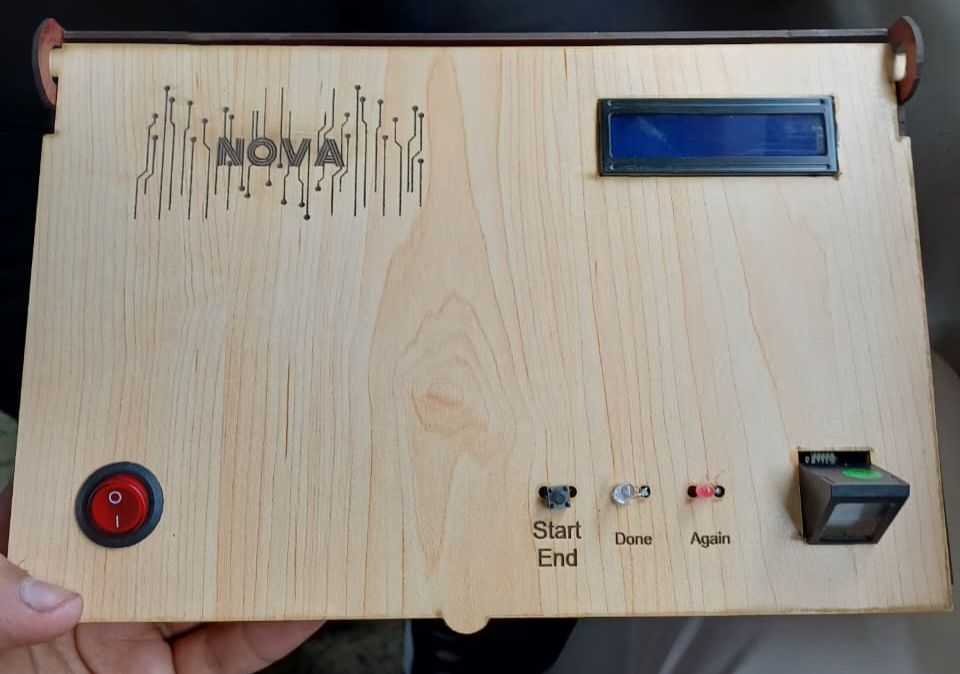
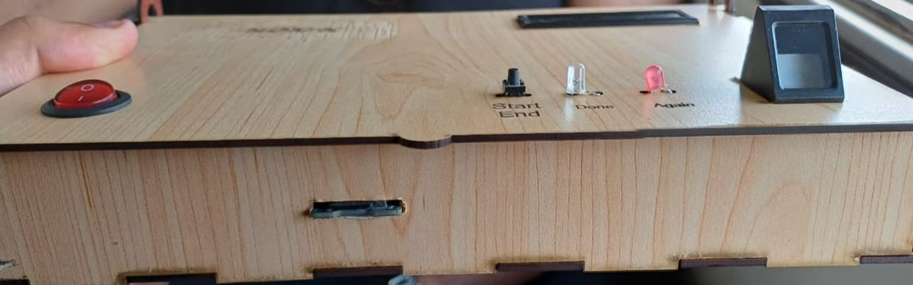

# Smart-Attendance-System
Smart Attendance System using Arduino, Fingerprint Sensor, and ESP8266 for automated WhatsApp reporting.
----

##  Features
- **Biometric Authentication:** High-accuracy user registration and verification via an optical fingerprint sensor.
- **Secure Local Storage:** Saves user credentials in `users.txt` and logs daily attendance timestamps in `attendance.csv` on the SD card.
- **Real-Time Clock (RTC):** Integrates DS3231 RTC to ensure highly accurate time and date logging.
- **Instant WhatsApp Alerts:** Automatically sends real-time confirmation messages to a specified WhatsApp number via the CallMeBot API.
- **Visual & Audio Feedback:** Uses an I2C 16x2 LCD to guide the user, combined with a buzzer sound and a green LED to indicate successful verification.

---

##  Components Used
1. Arduino Uno / Mega
2. Optical Fingerprint Sensor (AS608)
3. ESP8266 WiFi Module (ESP-01)
4. Micro SD Card Module + SD Card
5. RTC DS3231 Module
6. I2C LCD 16x2 Display
7. Active Buzzer & Green LED
8. Resistors (220 Ohm for LED & Voltage Divider resistors for ESP8266 RX protection)

---

##  Wiring Diagram

### 1. Fingerprint Sensor
- **VCC** ➡️ 5V
- **GND** ➡️ GND
- **TX** ➡️ Pin 2 (Arduino RX)
- **RX** ➡️ Pin 3 (Arduino TX)

### 2. Wi-Fi Module (ESP8266)
- **VCC / CH_PD (EN)** ➡️ 3.3V (External power source is highly recommended)
- **GND** ➡️ GND
- **TX** ➡️ Pin 8 (Arduino RX)
- **RX** ➡️ Pin 9 (Arduino TX - *via voltage divider to protect the 3.3V logic*)

### 3. I2C LCD Display & RTC DS3231
- **VCC** ➡️ 5V
- **GND** ➡️ GND
- **SDA** ➡️ Pin A4 (Connected in parallel)
- **SCL** ➡️ Pin A5 (Connected in parallel)

### 4. Micro SD Card Module
- **VCC** ➡️ 5V
- **GND** ➡️ GND
- **MISO** ➡️ Pin 12
- **MOSI** ➡️ Pin 11
- **SCK** ➡️ Pin 13
- **CS** ➡️ Pin 10

### 5. Indicators (Buzzer & LED)
- **Buzzer (+)** ➡️ Pin 7
- **Green LED (+)** ➡️ Pin 6 (with a 220 Ohm resistor)
- **GND (Negative Terminals)** ➡️ GND

---
<h2 align="center">📸 Project Showcases</h2>

<p align="center">
  
  
  
</p>

<p align="center">
  <i>The complete prototype of the Smart Attendance System showing the final hardware assembly and component integration.</i>
</p>

--------
##  Project Structure

The project has been split into separate modules (Modular Architecture) to optimize collaboration and avoid conflicts on GitHub:

```text
Attendance_System/
├── Attendance_System.ino   # Main file (handles setup and main loop control logic)
├── Hardware_Config.h       # Hardware pin definitions, libraries, and objects initialization
├── Biometric_Storage.h     # Functions for fingerprint processing and SD Card read/write operations
└── Network_Report.h        # Wi-Fi connection handling and WhatsApp AT command routines
```
------

## NOVA Team
* Mostafa Mohamed
* Mahmood Samy
* Mariam Mohamed
* Menna Ramadan
* Ahmed Mohamed
* Youssef Omar
* Malak Mourad

---
<p align="center">
  <b>Mansoura National University | AI Engineering</b>
</p>
